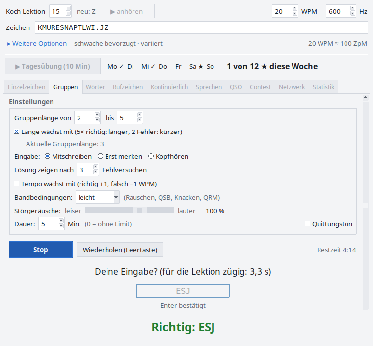
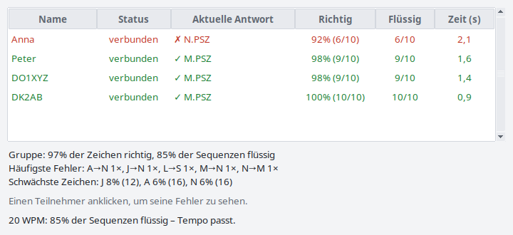

# Morsetrainer

Ein CW-Trainer für Einsteiger bis Contester, entwickelt von **DL4YM**.

Vom Lernen einzelner Zeichen nach der Koch-Methode bis zum eigenen
Contest-Pile-up unter realistischen Kurzwellenbedingungen – allein am
eigenen Rechner oder gemeinsam am Clubabend im lokalen Netz.

**English:** The program can be switched to English under „▸ Weitere
Optionen“ → „Sprache / Language“. English overview: [README.en.md](README.en.md).

## Was er kann

- **Koch-Methode** mit den Lektionen von lcwo.net und Koch-Tempo 20/10:
  Zeichen als Klangbild hören statt Punkte und Striche zu zählen. Die
  nächste Lektion wird angeboten, sobald 90 % sitzen.
- **Tagesübung (10 Min):** stellt zusammen, was heute dran ist –
  Aufwärmen, Hauptteil, Ausklang – mit drei Sternen am Tag und Wochenziel.
- **Übungen:** Einzelzeichen mit Zeitlimit, Gruppen, Wörter und
  Q-Gruppen, echte Rufzeichen (auch als Rufz-Durchgang), Mitschreiben im
  Fluss, Hören & Sagen ohne Tastatur (auch als MP3), komplette QSOs und
  Contest-Betrieb als Run-Station wie im Morse Runner.
- **Bandbedingungen:** Rauschen, QRN, QSB, Chirp, SSB-Gebrabbel und
  CW-QRM, einzeln regelbar.
- **Statistik:** je Zeichen, Lernkartei über Tage, häufigste
  Verwechslungen zum gezielten Üben, Diplome in Bronze, Silber und Gold
  zum Ausdrucken, Lebenslinie.
- **Netzwerk:** Kurs oder Clubabend im lokalen Netz. Der Trainer gibt vor,
  alle hören dieselbe Sequenz und tippen mit, der Trainer sieht live, wer
  was getippt hat. Auch mit festem Takt für Papier und Bleistift.

## So sieht er aus

### Mitschreiben im Koch-Tempo

### Diplom zum Ausdrucken

### Clubabend im Netzwerk

## Download

Fertige Programme gibt es unter
[Releases](https://github.com/tilde1970/Morsetrainer/releases), Python
wird dafür nicht benötigt:

- **Linux:** `Morsetrainer-x86_64.AppImage` herunterladen, ausführbar machen
  (`chmod +x Morsetrainer-x86_64.AppImage`) und starten.
- **Windows:** `Morsetrainer.exe` herunterladen und starten. Da die Datei
  nicht signiert ist, warnt Windows SmartScreen beim ersten Start
  („Weitere Informationen“ → „Trotzdem ausführen“).
- **macOS (Apple-Prozessor):** `Morsetrainer-macOS.zip` herunterladen,
  entpacken und `Morsetrainer.app` in „Programme“ ziehen. Die App ist nicht
  signiert, beim ersten Start muss man sie freigeben – siehe
  [Anleitung](docs/Anleitung.md#macos), dort auch der Weg für Intel-Macs.

Ab Version 2.30 liegt `SHA256SUMS.txt` mit den Prüfsummen daneben. Zum
Nachprüfen unter Linux `sha256sum -c --ignore-missing SHA256SUMS.txt`,
unter Windows in der PowerShell `Get-FileHash Morsetrainer.exe` und mit
der Zeile in `SHA256SUMS.txt` vergleichen.

## Erste Schritte

1. Oben **Koch-Lektion 1** einstellen (K und M); „▶ anhören“ spielt das
   neue Zeichen vor.
2. Im Reiter **Einzelzeichen** die Zeichen kennenlernen, dann im Reiter
   **Gruppen** mitschreiben, während der Ton läuft.
3. Oder einfach **▶ Tagesübung (10 Min)** drücken (F12) – sie schaltet die
   Reiter selbst um.
4. Unter „Einstellungen …“ (oben rechts) Rufzeichen und Name eintragen; sie stehen
   auf den Diplomen.

Alles Weitere steht in der [Anleitung](docs/Anleitung.md), im Programm
unter **Hilfe**.

## Sicherheit

- **Updates:** Beim Start fragt der Morsetrainer, wenn es ein neueres
  Release gibt, und tauscht auf Wunsch die exe bzw. das AppImage aus.
  Geladen wird nur aus diesem Repository über HTTPS, und die Datei muss zur
  Prüfsumme in `SHA256SUMS.txt` passen. Das fängt beschädigte Downloads
  ab, ersetzt aber keine Signatur: Wer das Release austauschen kann, kann
  auch die Prüfsumme austauschen.
- **Netzwerkmodus:** unverschlüsselt über TCP. Gedacht für das Club- oder
  Heimnetz, nicht für öffentliche WLANs. Nach 5 falschen PINs ist ein
  Rechner eine Minute gesperrt, Unbekannte kann der Trainer entfernen.
  Updates reicht der Trainer nicht weiter, er nennt nur seine
  Versionsnummer.

## Mehr

- [Anleitung](docs/Anleitung.md): alle Reiter, Tagesübung, Diplome,
  Netzwerk, Tastenkürzel, Daten und Sicherung
- [Änderungen](CHANGELOG.md) je Version
- [Entwicklung](docs/Entwicklung.md): aus dem Quelltext starten, Tests,
  Projektstruktur, Release

## Lizenz

MIT, siehe [LICENSE](LICENSE). © 2026 DL4YM

---

73 de DL4YM
