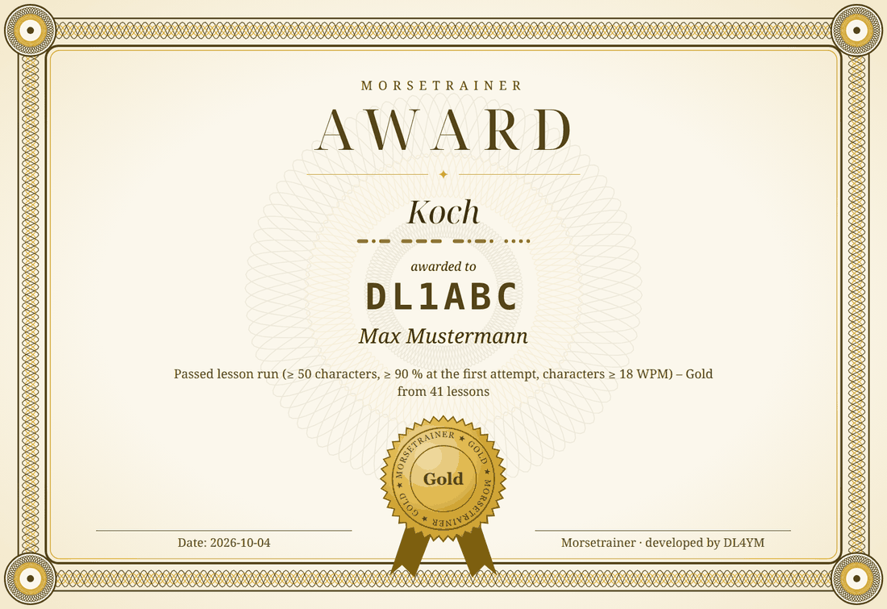

# Morsetrainer – Manual

A CW trainer for everyone from beginners to contesters, developed by
**DL4YM**. This manual is also in the program: the **Help** button on the
right of the footer shows it and the changes of the versions; Ctrl+F
searches in it. A short overview with pictures is in the
[README](../README.en.md).

**Language:** the program starts in German. Switch to English under
„Einstellungen …“ (top right, or Ctrl+Comma) → „Sprache / Language“; it
takes effect after a restart.

**Contents**

1. Getting started
2. Header and settings
3. The tabs: One by one, Non-stop, Speak, QSO, Contest, Statistics
4. Daily practice
5. Awards and lifeline
6. Band conditions
7. Network: practising as a group
8. Accessibility
9. Keyboard shortcuts
10. Installing and updating
11. Data

## 1. Getting started

The Morsetrainer follows the **Koch method**: you learn the characters at
full speed as a sound pattern from the start, first two, then one more at
a time. This is how to begin:

1. Set **Koch lesson** at the top to 1 (K and M). The default is **Koch
   speed 20/10** (can be restored at any time under “▸ More options”): the
   characters come fast enough that you hear them as a sound pattern
   instead of counting dits and dahs, with longer gaps in between.
   “▶ listen” plays the new character.
2. Get to know the characters in the **One by one** tab under
   **Characters**. The **time limit** is on from the start: there is no
   time to count, the character has to come as a sound pattern. After a
   session with at least 50 characters and 90 % correct – with time limit
   from start to finish, at most 1.5 s at the end – the program suggests
   continuing with groups.
3. Practise in the **One by one** tab under **Groups**: copy while the
   audio plays. If you get 90 % on the first attempt in a session of at
   least 50 characters, the **next lesson** is offered (details under
   “Koch lesson and moving up” in section 3).
4. From lesson 6 there are enough words for **Words** in the One by one tab
   (words with the newest character are favoured), then **Non-stop** and
   **QSO**.
5. In the **Statistics** tab, “Practise the 4 most frequent” shows which
   characters you confused in the last 30 days and practises exactly those
   against each other. “↩ Lesson” at the top takes you back to your lesson.

Or just press **▶ Daily practice (10 min)** (F12): it puts together what
is due every day and switches the tabs by itself (section 4).

**Short and daily** beats long and rare: the footer shows today's practice
time and the daily goal (adjustable in the Statistics tab), the week strip
at the top the days you practised.

## 2. Header and settings

### Header

The Koch lesson, speed (WPM), pitch (Hz) and character set are always at
the top; they apply to all tabs. **▸ More options** holds the practice
options:

- **Farnsworth:** characters at the set speed, but longer gaps between
  them (Koch speed 20/10). At a slow character speed (below 18 WPM) the
  header points out that the characters can be counted and offers Koch
  speed.
- **Favour weak characters:** characters you often confuse or recognise
  slowly, and those due today in the review box, come more often.
- **Vary pitch and speed slightly:** if you only ever hear exactly one
  sound, you will find it harder on the band.
- **Band conditions:** adjusting the interference (section 6).

### Settings

**Settings …** (top right, or Ctrl+Comma) opens a window with everything
you set once:

- **Callsign and name:** appear on the awards and are the default for “My
  callsign” in Contest and “Name/callsign” in Network (there the callsign
  if there is no name). Both fields follow along until you enter something
  else there, such as a contest callsign. Without a callsign of your own
  the name is enough; for the contest you then enter a made-up callsign.
- **Sprache / Language:** switch the interface to English (takes effect
  after a restart). The voice in the Speak tab stays German.
- **Accessibility:** font size, high contrast, announcements (section 8).
- **Data:** back up and restore (section 11).

**Font size:** under “Settings …” or with Ctrl+Plus, Ctrl+Minus and Ctrl+0
(normal) the whole interface gets larger, up to 200 %; the window grows
with it. For small screens it also goes smaller, to 90 % and 75 %. Arrows,
scrollbars and sliders grow with it, as do the full result in Non-stop and
the solutions window in Network. The setting is saved.

## 3. The tabs

The tabs are **One by one**, **Non-stop**, **Speak**, **QSO**,
**Contest**, **Network** and **Statistics** (Alt+1 to Alt+7). Start and
stop with the button or F5 (F10 in Contest).

### One by one

Listen, answer, the next one. At the top under **Content** you choose
**Characters**, **Groups**, **Words** or **Callsigns** (also with the arrow
keys or by pressing Alt+1 again); the choice is saved. The space bar
repeats; recognised only after the repeat counts as not recognised.

**Characters:** recognise single characters, without interference. After
each answer you see your reaction time and the limit, e.g. “0.38 s, limit
1.20 s”.

- **Time limit** (Instant Character Recognition): the limit counts from
  the end of the last dot or dash. It gets shorter while you answer
  reliably and longer when you miss characters; a confusion leaves it
  unchanged. The space bar repeats but does not extend the deadline.
- After a confusion you hear the correct character and the one you typed
  back to back. A wrongly recognised character is played again right away
  while the solution is shown, and asked again after a few other
  characters.

**Groups:** copy groups of characters. The group length can grow: start
short, one longer after 5 correct groups, one shorter after 2 wrong groups
(each on the first attempt). After an error you see and hear the solution,
then it goes on as on the air; weak characters come back later through the
weighting. Under “Show solution after” you can allow up to 3 failed
attempts: then only the wrong positions are marked at first and the group
comes again.

**Words:** CW abbreviations, Q codes and QSO words, only from characters
you already know. The default is “Listen first”: hear the whole word, then
type; a slow answer is noted. R, K and the prosigns KN and SK also appear
(but do not count as words for the minimum). A weak character comes up
more often, but in changing words. The meaning is shown after the answer.
You can add your own words (section 11).

**Callsigns:** real callsigns from the Super Check Partial list, by default
only from characters you have already learned (from Koch lesson 23 with
the first digit), occasionally with /P, /M, OE/… as in contests.
Optionally as a **RufZ run** (modelled on RufzXP): 50 callsigns, one
attempt each, the speed grows, score = length × effective speed, best
score (with starting speed) and history. Afterwards you can replay the
missed and slowly recognised callsigns (F6): first just listen, then again
with the solution, at the original speed.

**Options in Groups, Words and Callsigns:**

- **Input:** *Copy while listening* (type while the audio plays), *Listen
  first* (type after the audio) or *Head copy* (type nothing; Enter
  reveals, then J = knew it, N = didn't). Head copy relies on your own
  assessment and therefore does not count for the overall statistics and
  the lesson.
- **Speed adapts** (as in RufzXP): correct on the first attempt +1 WPM,
  wrong −1 WPM – meaning the effective speed. With Farnsworth the gaps get
  shorter first; once they are gone, the character speed increases. The
  characters get slower only down to 18 WPM, below that the gaps get
  longer, so you cannot count. The same rule applies to “Adjust speed
  automatically” in the QSO tab. The history shows the effective speed
  (e.g. 10 at 20/10 WPM).
- **Band conditions** on and off (they are set centrally, section 6). They
  also run under the start sign (VVV =) and the end sign (+).

**Koch lesson and moving up:** if you get 90 % on the first attempt in a
session of at least 50 characters in Groups (or in Non-stop), the next
lesson is offered.

- A first attempt only counts for the lesson without repeating with the
  space bar and with a quick answer (1.5 s plus 0.6 s per character after
  the end of the tone); typing too much counts as an error.
- Weak and new characters automatically come up more often.
- After the 40 lessons of lcwo.net, **lesson 41** completes the course:
  all characters, none favoured as new any more (weak ones still come more
  often).
- If you like, **lessons 42–45** then add the prosigns from QSOs: AR (key
  `+`), KN (`(`), SK (`*`) and BK (`#`). The trainer does not move there by
  itself; set the lesson at the top. After that, the next prosign is
  offered again. The daily practice also repeats prosigns you have learned.

### Non-stop

The audio keeps running without waiting, you type along (as when
listening on the air); even if you fall behind, it carries on. At the top
under **Content** you choose **random characters** – in groups (default
5) with a word gap in between, continuous with group length 0 – or **plain
text**: words, typical QSO phrases (“TNX FER CALL”, “UR RST 599”),
callsigns or complete QSOs (plain text does not count for the lesson).
Optionally with band conditions running under the whole session.

- A key only counts if it fits the character: not guessed in advance and
  at most 5 s after it; typing too much counts as an error.
- After stopping (F5 or Esc) a comparison shows the last 90 characters (in
  lines of 30).
- **Everything in a separate window** shows the whole session, split into
  the groups as sent (without groups in blocks of 5), errors in red,
  larger/smaller font, copyable – or only the sent text, to check against
  your paper.

### Speak

Listen and say without a keyboard (like Morse Code Ninja): Morse code,
then a thinking pause in which you say out loud what you heard, then a
voice announces the solution and the code comes once more. Choose the
content at the top under **Content**.

- Characters, groups and callsigns are spelled in the phonetic alphabet
  (Alfa, Bravo …), words and phrases as a whole or with their meaning.
- The thinking pause is deliberately short (default 1 s plus 0.3 s per
  character).
- Content: characters, groups, words, phrases, callsigns (groups with an
  adjustable length).
- **Save as MP3** for on the go (phone, car).
- Counts only for practice time. *The voice is always German.*

### QSO

Listen to complete QSOs: normal QSO or contest runs (CQ WW, CQ WPX, WAG,
ARRL DX, IARU HF) with adjustable pile-ups (default off). Next to the
length the estimated duration is shown. Evaluation is your choice:

- **log check**: log afterwards, F8 checks;
- **typing along**: continuously as in Non-stop, result in percent;
- **head copy + questions**: no notes, afterwards content questions about
  name, QTH, rig, weather … or the exchange;
- or listen only.

How often you used “Again” before checking is noted. “Adjust speed
automatically” follows the same rule as “Speed adapts” in One by one.

### Contest

You are the running station (similar to Morse Runner): call CQ, pick up
callers, send the exchange, log. F10 starts and ends.

- As in a real contest, callers sometimes answer to an almost correct
  call. If you notice the mistake, correct the call and confirm with Enter
  (“Call TU”), otherwise “Busted” appears in the log.
- “?” in the call field asks back (DL1?, DL?ABC).
- Speed and pitch spread of the callers are adjustable.
- At the end there is a summary by type of error.
- The function keys are laid out as in contest programs (section 9).

### Statistics

Overall statistics per character – only from random characters and
callsigns, because in words, phrases and QSOs the context gives away too
many characters. Runs with band conditions do not count here (section 6).

- **Ø reaction:** the time from the last dot or dash to your input,
  averaged over the correct answers – independent of character length and
  speed. Measured in Characters, when copying without repeating, in
  Non-stop, in QSO type-along and on the network, otherwise “–”. When
  copying along it counts from the end of the tone or from your previous
  key, whichever is later – writing behind or listening to the whole group
  first does not count as slow. A reaction under about 0.6 s is a common
  guide for recognising without thinking.
- **Ø WPM:** the effective speed of the correct answers: the length of the
  character divided by the time from its start to your input, converted to
  WPM (at most as fast as it was sent).
- **Review box** (spaced repetition over days): characters recognised
  reliably and quickly come back after 1, 2, 4 … 32 days, uncertain ones
  the next day. Decided once a day from 5 attempts, promoted only from
  random characters. Due characters come up more often with “weak
  favoured” and can be practised specifically.
- **Most frequent confusions** of the last 30 days, with a button to
  practise them against each other.
- **Daily goal**, **awards** and **lifeline** (section 5) and the
  **progress history** per exercise.

## 4. Daily practice

Can't be bothered to decide what to practise today? **▶ Daily practice
(10 min)** at the top (or F12) puts together ten minutes from whatever is
due and switches the tabs by itself. Afterwards the tab settings are back
as they were.

| Level | Warm-up | Main part | Wind-down |
|---|---|---|---|
| Lesson 1–9 | Characters with time limit, 3–4 min | Groups, fixed speed | Non-stop, groups of 3, 2 min |
| Lesson 10–29 | as above | as above | Words, 2 min |
| Lesson 30–41 | as above | as above | Words or callsigns on alternate days, 2 min |
| after Koch (lesson 41 passed) | Characters, 2 min | Non-stop, groups of 5, 4 min | Callsigns, 4 min |

- **Warm-up** with all characters of the lesson; those due today in the
  review box come more often, or, if nothing is due, your most frequent
  confusions. With many due characters it gets a little longer and the
  main part correspondingly shorter. The time limit continues where it
  ended last time and is never longer than 1.5 s here.
- **Speed:** the main part keeps a fixed speed (characters at least
  18 WPM). It changes once a day, effective from the next: below 75 % on
  the first try (at least 100 characters) 1 WPM slower. After Koch, 90 % or
  more also makes it 1 WPM faster; not before, because a good day then
  already brings the next character.
- **Lesson:** if the main part meets the Koch criterion (50 characters,
  90 % on the first try), the next lesson applies from the next day – no
  question asked. The daily practice keeps its own lesson for this (the
  first time the one from the header); lesson and character set at the
  top stay as you set them for free practice.
- **Three stars a day:** ★ *Showed up* for the full 10 minutes, ★ *Clean*
  for 90 % on the first try in the main part (80 % in the first three days
  of a new lesson), ★ *Ahead* for real progress: next lesson earned, a
  character reaching box 3 of the review box for the first time, or a
  daily speed you never had before. A second daily practice on the same
  day can add missing stars; earned stars are never lost, not even when
  you stop early.
- **Between the blocks** a short card shows the result, new stars and
  what comes next. It stays until you continue with Enter or “Continue”;
  Esc ends the daily practice.
- **Evening summary:** stars, what improved compared with the week before
  (reaction time per character, group score; only with enough data and at
  the same speed, never “worse”), how much is missing for the next lesson,
  where you stand on the weekly goal and, if the main part went well, once
  a day **5 more min** with something different: your confusions within
  the lesson, a RufZ run or words.
- **Week:** next to the button is the week strip from Monday, e.g.
  “Mon ★★★  Tue ★★  Wed ✓  Thu –  Fri ·” (✓ = practised freely without the
  daily practice, daily goal reached; – = no practice), and next to it
  where you stand on the **weekly goal of 12 stars**. Four to five days of
  practice get you there; a missed day doesn't cost you the week. Until
  the first daily practice of a new week it shows a look back, e.g.
  “Last week: 4 days, 11 ★, lesson 12 → 13”.

## 5. Awards and lifeline

### Awards

Like DXCC or WAC on the air: awards for what you can do for good, in the
levels **Bronze, Silver, Gold** and some in **Platinum**. They are checked
after every exercise. A new seal shows a window with the date and a
**Print** button – the award opens as a certificate in the browser (A4
landscape) with your callsign and name from “Settings …” (which you can
also change in the window). During the daily practice the window comes
only after the evening summary, which also mentions the new seals.

Every award has its own motif on the left in the style of an intaglio
engraving like on banknotes, e.g. the straight key for Koch, the racing car
for QRQ or the rotary dial for “All digits”. On the right stands the club
house of the Gütersloh club (N47), where the Morsetrainer is made.



**Award number:** with a callsign entered, a number such as
`DL1ABC-KOCH-G-20261004` appears at the top right: callsign, award, level
(B, S, G, P) and date. It is unique, because each level is awarded only
once per callsign.

**Overview:** in the **Statistics** tab under “Awards”, with the seals
achieved, the next goal (e.g. “Silver: 18 / 25 lessons”) and from which
lesson it can be reached; open ones are grey. Club night only works
together in the network and is listed last while it has no seal. A
selected row shows the condition and the days of the seals, for
QRN-proof, Contest and Confusion also how close you are to the next level
(best run or the next pair with the days left). “View and print award”
shows the award of the highest level, “Preview: next goal” that of the
next open level – stamped “PREVIEW”, without date and number.

| Award | Levels | From lesson | Condition |
|---|---|---|---|
| Koch | Lesson 10 / 25 / 41 | 1 | Passed lesson run: ≥ 50 characters, ≥ 90 % at the first attempt, characters ≥ 18 WPM (groups or non-stop) |
| Worked All Letters | 10 / all 26 letters in box 3; Gold: all in box 6 and all digits in box 4 | 1 | Spaced repetition; the highest box ever reached counts, reached with characters ≥ 18 WPM |
| Copying in flow | 10 / 15 / 22 WPM effective | 15 | Non-stop with plain text (words, phrases, QSO; Gold only phrases or QSO), character set at least lesson 15, full 3-min run, ≥ 90 % minus extra keys, characters ≥ 18 WPM. With your own words from `woerter.txt`, “words” does not count |
| QRQ | 20 / 25 / 30 / 35 WPM | 40 | Non-stop with random groups (≥ 5 characters) from the full character set, no Farnsworth, full 3-min run, ≥ 90 % minus extra keys |
| QRN-proof | conditions light 90 % / medium 90 % / heavy 85 % | 25 | Groups or non-stop with random characters, ≥ 200 characters, band conditions on for the whole run and not made easier, noise volume ≥ 100 %, characters ≥ 20 WPM, effective ≥ 12 WPM; in groups the first attempt in time counts |
| Rufz | 2,000 / 3,500 / 5,500 / 7,500 points | 27 | Full run with 50 calls, no prefix filter, starting speed ≥ 20 WPM |
| Contest | see right | 41 | Run ≥ 10 min; Bronze: ≥ 20 WPM, 10 QSOs in 10 min, ≤ 10 % errors; Silver: ≥ 25 WPM, activity ≥ 2, 20 QSOs, ≤ 5 %; Gold: ≥ 30 WPM, activity ≥ 3, 25 QSOs, at most 1 error |
| WPX | 100 / 400 / 1,200 / 2,000 prefixes | 25 | Different WPX prefixes, right at the first attempt (callsigns and contest, there without asking for the call again), characters ≥ 18 WPM |
| Headphones | 15 / 20 / 25 WPM effective | 41 | 3 normal QSOs in a row with “Head copy + questions”, all questions right, without “Again”, characters ≥ 18 WPM; Silver and Gold with the length Normal or Long. Skipping a QSO without “Check” breaks the run |
| Confusion overcome | 1 / 3 / 6 pairs | 5 | A pair that was among your most frequent confusions, confused at most once in 28 days with ≥ 40 attempts each |
| Endurance | 10 / 50 / 150 / 365 days | – | Days with ≥ 10 min practice, not in a row |
| Characters heard | 5,000 / 25,000 / 100,000 / 250,000 | – | Correctly recognised random characters, characters ≥ 18 WPM |
| Club night | 1 / 5 / 15 / 40 evenings | – | Days with ≥ 10 min of network sessions in total, taken part in or led as trainer (only runs with participants) |
| First QSO understood | – | 40 | Normal QSO with questions, all right, without “Again”, ≥ 15 WPM effective, characters ≥ 18 WPM |
| Worked All Contests | – | 41 | All 5 contest types with ≥ 30 QSOs each and ≤ 10 % errors |
| Q-code expert | – | 40 | Each of the 20 Q codes right 3× at the first hearing, on at least 2 days, characters ≥ 18 WPM |
| All digits | – | 39 | All 10 digits at least in box 3, reached with characters ≥ 18 WPM |

- For Koch, flow, QRQ, QRN-proof, Rufz and contest, **Silver and above need
  two different days** – one lucky run is not enough. Starting straight at
  lesson 41 gives Bronze on the first day and Silver and Gold with another
  passed run on a different day.
- Only runs without self-assessment count.
- Seals achieved are kept with their date in the database and are never
  lost, not even with “Reset overall statistics”.
- On the first start with awards, whatever follows from your practice so
  far is filled in quietly (with the day it was reached); one note says
  how many awards that is.

### Lifeline

Below the awards on the Statistics tab, the **lifeline** shows the long
road from your first practice until today: daily-practice stars added up,
the highest Koch lesson practised (up to the final lesson 41) and the
daily speed of the daily practice, with the award seals underneath as
diamonds in their colour. All three lines only rise or stay level; hover
with the mouse to see the values and seals of each day. The lifeline stays
complete after “Reset overall statistics”.

## 6. Band conditions

### Setting them

They are set in one place: **More options → Band conditions → Adjust …**,
“Adjust …” in a tab, or Ctrl+B. In the tabs you only switch them on or off.

Each can be switched on and adjusted: band noise, static crashes (QRN),
QSB, chirp (chirpy transmitter), SSB QRM (detuned speech), CW QRM on the
adjacent frequency and **strength differences** (how differently loud the
stations arrive in QSO and contest); plus the **noise volume** relative to
the signals. The buttons **light**, **medium** and **heavy** set the levels
that the QRN-proof award counts; the window shows which level the setting
matches at least.

| Level | Noise (S/N) | QSB (deepest dip) | plus |
|---|---|---|---|
| light | +8 dB | 30 % (about −3 dB) | – |
| medium | +2 dB | 50 % (about −5.5 dB) | QRN 30 % |
| heavy | −4 dB | 80 % (about −12 dB) | QRN 50 %, CW QRM 30 % |

- **Signal-to-noise ratio (S/N):** measured in 2.4 kHz bandwidth relative
  to the unfaded signal; the slider ranges from +20 dB to −10 dB. The ear
  hears CW like a filter of about 50 Hz, where the ratio is roughly 17 dB
  better – so −4 dB feels like a good +13 dB in a narrow filter. If the
  noise gets louder than the receiver would pass, it turns the signal down
  like an AGC instead of clipping.
- **Fading** changes irregularly (two overlaid variations); its depth
  follows the slider and varies only a little – the level sets the
  difficulty, not chance.
- **Chirp** is shown in Hz (largest offset while keying).
- **CW QRM offset:** the adjacent run is **far** (300–500 Hz) away,
  **close** (50–200 Hz) or at **zero beat** (almost on your frequency).
  Close and zero beat are the real training in selective listening that
  contesters need. With QSB switched on, the QRM fades too, independently
  of your stations.

**More interference** (expandable) is not part of any level and does not
count for the award; “All on” does not switch it on: thunderstorm (QRN in
bursts), AGC pumping after crashes, flutter (aurora), carrier (someone
tuning up) and the interference that troubles many hams most today:
**switching power supply** (rough 100 Hz buzz – 120 Hz on 60 Hz mains –
with a wandering whistle), **PLC** (powerline data noise, in packets),
**electric fence** (a tick about every second) and **key clicks** (the
neighbouring run keys hard; its clicks get through even a narrow filter
when its tone stays outside).

**CW filter:** 2.4 kHz (like an SSB filter, the default), 500 Hz or
250 Hz around your pitch. Signals, noise and interference pass through
it, your own sidetone in the contest does not.

- A narrow filter removes noise (500 Hz about 6 dB, 250 Hz about 9 dB, the
  same at every pitch: it moves with your pitch like an IF filter) and QRM
  that is far away.
- But it rings slightly, and stations off your pitch (callers in the
  contest, the other station in a QSO) get quieter. It does not help
  against close or zero-beat QRM.
- The S/N value still refers to 2.4 kHz; the window also shows the value
  inside the filter. The levels and the award count the value inside the
  filter: “medium” with a 500 Hz filter is about “light”.

**Listen** (button at the bottom of the window, Ctrl+P): plays CQ calls
at your pitch and speed under the conditions currently set, with your
callsign from the settings, without a time limit. Whatever you change
meanwhile can be heard at once; a second press (or closing the window)
stops. It counts for nothing (statistics, practice time, awards). During
a run and in a network session the button is disabled.

### Practising with band conditions

**When to switch on?** Learn new characters without interference –
that is why Characters in the One by one tab has none. Band conditions pay
off once the character set is solid without them (90 % or more); then
start with “light”. Practice works best at “light” to “medium”: according
to studies (with speech, not Morse), practising in moderate noise carries
over to quiet conditions better than practising in very heavy noise.
“Heavy” is for polishing.

- **During a run:** strength and volume take effect immediately; the
  award then counts the weakest setting of the run. In Groups, Words,
  Callsigns, Non-stop and Network you can switch them on or off only
  between runs, in QSO and Contest at any time.
- **In the answer pause** fading, noise and neighbouring QRM keep running
  as on the air; each sequence hits a different spot. In Groups, Words and
  Callsigns you hear the band 6 dB quieter meanwhile, so your ear gets some
  rest while typing; it comes back up with the next sequence. With
  announcements (F9) it fades out before the feedback. If you need silence
  between sequences (with tinnitus, for example), switch off “Band in the
  answer pause” in the window; it makes no difference to the level or the
  award.
- **The solution** after too many failed attempts always comes without
  interference, so you hear sound and solution together clearly.
- **Statistics:** runs with band conditions appear in the history but do
  not count for the character statistics, the weighting, the confusions or
  the review box: a character lost in the noise or in a QSB dip says
  nothing about whether you know it.
- **On the network** all participants hear the trainer's setting, with
  the same fading, the same stations and the same neighbouring QRM,
  thunderstorm and carrier (trainer and participants from version 2.39).
  Only someone with their own `callsigns.scp` may hear other callsigns in
  the QRM.

## 7. Network: practising as a group

For classes and club evenings: all computers are on the same network
(Wi-Fi or LAN), one is the **trainer**, the others join as
**participants**. Only text is sent; each computer generates the sound
itself – no dropouts, with its own headphones and its own pitch.

### Trainer: leading a session

1. In the **Network** tab choose “Trainer”, **Open session**. The address
   and a four-digit PIN for the participants are shown.
2. Choose the **content**: characters, groups, words, callsigns, phrases,
   QSO plain text or **own text** (one line per sequence; prosigns as + for
   AR, ( for KN, * for SK, # for BK).
3. Choose the **number of sequences** (for QSO plain text whole QSOs, sent
   in sections up to the next =, K or closing sign such as “UR RST 599 599
   =”), the **answer time** and band conditions. Character set, speed and
   Farnsworth come from the header.
4. **Start:** the start sign VVV = comes first (can be switched off), the
   end sign + after the last sequence. Everyone gets the same sequence at
   the same time. The next one comes once everyone has answered or the
   answer time is up (or with **Next**, F7); **Repeat for everyone** (F6)
   plays the current one again.

**The table** shows each participant's current answer, share of correct
characters, how many sequences were **fluently** correct and typical time
from the end of the tone to Enter, and below it the group: accuracy, share
of fluent sequences, most common errors, weakest characters.

- **Fluent** means correct on the first hearing and fast enough that
  nobody counted – within the same window as for Groups, Words and
  Callsigns in the One by one tab (1.5 s plus 0.6 s per character after
  the tone). The answer time is only the hard limit.
- Clicking a participant shows their errors and weakest characters.
- With many participants the table can be moved **into a separate
  window** (for a second screen or a projector); F5–F7 work there too,
  closing it brings the table back into the tab.
- **Speed recommendation:** after enough sequences at the same speed (50
  characters across everyone), faster from 90 % fluent, slower below 75 %,
  applied with a button in steps of 1 WPM effective.
- **Save as CSV** stores a table in `stats/`: one row per participant with
  accuracy, fluent sequences, most common errors and weakest characters,
  one column per sequence (with speed; ↻ = repeated for everyone) with what
  was typed and the time to answer.

**Solutions:** the button next to “Save as CSV” opens a separate window
for the projector. During the run it shows the current number in large
type (“Missed one? Leave a gap and carry on with the next number.”),
afterwards all solutions numbered, column by column from top to bottom as
on paper, in a monospaced font; ↻ marks what was repeated for everyone.
A−/A+ (or +/−) change the font size, **Copy** puts the list on the
clipboard. Clicking a solution – or the arrow keys and space – plays it
again on the trainer's computer without interference, so reading the
answers becomes hearing them again.

### Flows

**Wait for answers** (default): as described above.

**Fixed pace (copying on paper):** for classes where not everyone has a
computer. The next sequence comes after the tone plus a **writing pause**,
whoever has answered.

- The pause is the same for every sequence; its default depends on the
  content (characters 2 s, words 3 s, groups, callsigns and own text 4 s,
  phrases and QSO 5 s), because too much time invites brooding.
- Until the end the trainer's screen shows no solution – it may be on the
  projector: the status only says “No. 7 of 20”, the table only whether an
  answer came in; results and own text are hidden.
- **Repeat for everyone** (F6) stays for emergencies and extends the
  deadline; **Next** (F7) moves on at once. Blocks of 20–25 sequences with
  solutions in between work better than “until Stop”.
- **Pen and paper only:** needs neither a computer nor a login but listens
  through the trainer's speakers – so switching to the fixed pace turns on
  “Also play on this computer”. They check their own copy against the
  solutions or hand in their sheet; after the run the trainer types it in
  under **Enter paper sheet** (name, then the line for each number, empty =
  missed; the same name replaces the sheet).
- **With a computer, but on paper:** anyone who still wants to copy with a
  pen ticks “With fixed pace, copy on paper and type it in at the end”
  when connecting. The input field stays closed during the run, afterwards
  there is one field per number to type in the copy, and **Evaluate** sends
  it to the trainer.
- Typed-in answers count for right/wrong, errors and weak characters, but
  without timing: not as fluent and not for the speed advice, and in one's
  own statistics not for weighting and spaced repetition. The table shows
  “Paper” for them.
- **Print answer sheet** opens a sheet in the browser for printing: name,
  date, numbered lines column by column as in the solutions – with one box
  per character for groups and single characters, otherwise a blank line;
  as many lines as set (25 for “until Stop” and QSOs).

**Non-stop:** under *Flow* choose “Non-stop” and set the **duration** in
minutes. Groups (or words, callsigns …) then come without pauses as in the
Non-stop tab until the time is up; everyone types along continuously,
without Enter. Scoring happens at the end as there: a key only counts if
it fits the character in time. Each participant reports their result per
group, so the table, solutions (numbered groups) and CSV work as usual.
During the run the trainer screen shows only the remaining time. Stopping
early scores up to that point. Band conditions lie under the whole run;
own text is not available here.

**Sound for everyone from the speakers:** with “Sound for everyone only
from this computer (speakers)” only the trainer's computer plays; the
participants' computers stay silent and are only used for typing. Nobody
needs headphones and everyone hears the same thing at the same time –
otherwise each computer plays slightly offset, depending on the network
and sound card. The participants' computers measure the time to answer
from when the sequence arrived. The solution is then played once for
everyone over the speakers as soon as someone did not have it fluently
correct. This works in all flows and suits the fixed pace when paper and
computers are mixed.

### Participant: joining in

1. In the **Network** tab choose “Participant”, enter name or callsign and
   the PIN.
2. **Search** (or enter the trainer's address) and **Connect**.
3. You type while the tone is still running; the answer is done with the
   last character, Enter is only needed if you have fewer characters.

- There is one attempt per sequence, then the solution is shown. If it was
  not fluently correct, the sequence is played again with the solution
  (the trainer can switch this off). If you are not finished in time, what
  you have typed so far is scored.
- At a fixed pace it then only shows “No. 7 noted”; the solutions come at
  the end as a list with sent, typed and ✓/✗, and each sequence can be
  heard again with a double-click or space.
- The results count for your own statistics like a normal run, with the
  time per character as when copying along. After “Repeat for everyone” or
  when too slow, a correct character counts as uncertain and comes up more
  often with “weak favoured”. Practice time only counts while a run is
  going, not while waiting for the trainer.
- **Protect your hearing:** anyone with tinnitus or a hearing aid ticks
  “Interference quieter for me” and chooses 10–90 % of the trainer's
  setting. Only noise and interference get quieter, the signals stay the
  same; it can never be louder than at the trainer. So that results stay
  comparable, the trainer sees a **↓** after the status, in the detail
  line and in the CSV file. When the trainer's loudspeaker plays, the
  trainer's setting applies.
- If the trainer has a newer program version, the participant is asked on
  connecting whether to download it (section 10); the Morsetrainer then
  restarts and connects to the trainer again.

### Network and security

- The trainer needs port 7373 (TCP) and 7374 (UDP) for the search. On
  Windows the firewall asks the first time – allow it for private
  networks. If the search finds nothing (some Wi-Fi networks block
  broadcasts), enter the address shown by hand.
- The connection is not encrypted, and the four-digit PIN only prevents
  mistakes, not attackers. Anyone reading along on the same network sees
  names, practice text and answers and could log in with the PIN. Network
  mode is meant for a club or home network; on unfamiliar or public Wi-Fi
  (hotel, café, fair) better not open a session, and close the session
  after the class.
- After 5 wrong PINs a computer is locked for a minute (even for the right
  PIN), and “Wrong PIN from … too often” appears below address and PIN. If
  a stranger shows up in the table, select them and click **Remove**: the
  connection is dropped, and this computer cannot get back in until the
  session is closed. The trainer also disconnects computers that flood it
  with connections or messages.
- The trainer does not pass on updates: it only tells its version number,
  the download always comes from GitHub.

## 8. Accessibility

### Announcements (F9)

The program uses its built-in voice to say what is otherwise only on
screen – no screen reader needed. F9 switches announcements on and off
(also under “Settings …” → “Announce feedback”), and the voice confirms
it. Announcements use the language of the interface: German with the
Thorsten voice, English with the Lessac voice (callsigns then “Delta Lima
One”). If the voice is missing, F9 and F11 play an error tone and the
reason appears in the status line.

**Where am I? (F11)** reads out the tab, status, last feedback and
remaining time, during daily practice the current card, in the Statistics
tab an overview (overall result, most errors, confusions, review box,
seals, practice today) – even with announcements switched off.

### What is announced

- **One by one:** in Groups, Words and Callsigns the result of each answer
  (“Right”, “Wrong. Listen again”, after the last attempt “Sent: kay, em,
  you. Typed: kay, em, em”), the solution in head copy; in Characters only
  errors (“Wrong. kay, not em”), correct answers get the short confirmation
  tone. The program waits until the announcement has finished.
- **Everywhere:** the result at the end of each run, the tab name when
  switching (in One by one with the content), the cards of the daily
  practice and messages why a run does not start (e.g. too few characters)
  or stops (no sound output).
- **QSO:** at the end, what to do next (“enter your log … F8 checks”) or,
  when copying along, the result in percent; in the quiz the name of the
  field when you enter it (“Name, Station 2”), after “Check” the result
  with the correct values (callsigns spelled, names as words) and, when you
  return to a field, whether it was right.
- **Contest:** logging errors right after your TU, in the audio over the
  pile-up (“Busted. Correct: Delta, Lima, One …”, “Wrong exchange”, “Not in
  log”); correctly logged QSOs stay silent so the rate does not suffer.
  Callsigns in “My callsign”, the call field and the log are spelled in the
  phonetic alphabet. The result at the end.
- **Speak:** the tab speaks by itself while practising; announced are only
  why it does not start, the end (“Done: 20 items”), the MP3 export and its
  result. F11 gives the progress (“3 of 20”).
- **Network as a participant:** connecting, disconnecting and being
  rejected; after each answer “Right” or “Wrong. It should be: kay, em,
  you” (not with fixed pace, where the next sequence follows at once); the
  result at the end, after the end sign; with paper, the prompt to type in
  your copy and then the result. New sequences from the trainer take
  priority and interrupt an announcement; the solution is replayed only
  after the announcement.
- **Network as trainer:** when the session opens, address and PIN are
  announced; F11 repeats them.
- **Evening summary:** read out in full – stars, weekly goal, what has
  improved, what is almost done, new seals – then “Enter: Done” and, if
  offered, “With Tab: 5 more min …”. F11 in the window repeats it.
- **Award window:** new seals with condition and date, then the hint on
  Tab and Escape; the print buttons say which award they print. F11 in the
  window repeats.
- **Windows:** when a window opens (band conditions, settings, help …), it
  says its name: “Window Band conditions”. If the window speaks itself
  (award, daily practice), the name comes first. When you close a window,
  you hear where you are (“Back in the main window. Tab One by one,
  Groups.”); merely minimising stays silent.
- **Symbols and units** such as %, →, ≥, ★, Hz or min are spoken as words
  (“one minute”, “3 failed attempts”).

### Using the keyboard

- **Controls:** when you Tab into a field, button or check box, it says
  what it is and how it is set (“Sprache / Language, list, English”, “High
  contrast, check box, off”, “Speed, number field, 20 WPM”); changes with
  the space bar, arrow keys or in a list are announced too. When the
  program sets the focus itself (e.g. into the answer field), it stays
  silent.
- **Typing:** in the settings fields (characters, callsign, name, prefix
  filter, network, search in the help) and in all number fields each typed
  character is spelled out, deleted ones with “deleted”. Not in the answer
  fields of the exercises: there the announcement would cut off the Morse
  tone. The “Characters” field reads its content character by character.
- **Tables** (statistics, awards, contest log): when you Tab into one, the
  first row is selected; with the arrow keys each row is read out with the
  column names.
- All keyboard shortcuts are in section 9.

### Seeing

- **Font size:** Ctrl+Plus, Ctrl+Minus, Ctrl+0 (section 2).
- **High contrast:** “Settings …” → “High contrast (black, white,
  yellow)”, takes effect after a restart. Black background, white text,
  yellow main buttons and highlights, strong borders; all text stands out
  from its background by at least 7:1.
- Right and wrong are always shown as text too, not only as colour.

## 9. Keyboard shortcuts

On the Mac, Alt+digit and the shortcuts with letters use Cmd instead of
Alt or Ctrl (Cmd+1, Cmd+B, Cmd+Comma).

| Where | Key | Effect |
|---|---|---|
| Everywhere | Alt+1 … Alt+7 | tabs One by one, Non-stop, Speak, QSO, Contest, Network, Statistics |
| Everywhere | Alt+0 | Statistics tab |
| Everywhere | Ctrl+Tab | cycle through the tabs |
| Everywhere | F9 | announcements on/off |
| Everywhere | F11 | read out where you are |
| Everywhere | F12 | start daily practice |
| Everywhere | Ctrl+Plus, Ctrl+Minus, Ctrl+0 | font larger, smaller, normal |
| Everywhere | Ctrl+B | open band conditions (inside: Ctrl+P listens) |
| Everywhere | Ctrl+Comma | settings |
| Everywhere | Tab, Shift+Tab | through fields, buttons and check boxes (focus highlighted in colour) |
| Everywhere | Space, Enter | press a button; space toggles check boxes |
| Everywhere | arrow keys | choose in lists, sliders, tabs, tables and the “Content” row (One by one, Non-stop, Speak) |
| Everywhere | Esc | close secondary windows |
| Daily practice | Enter, Esc | skip the card between blocks, end daily practice |
| One by one, Non-stop | F5 | start/stop |
| One by one | Alt+1 (again) | next content: Characters → Groups → Words → Callsigns |
| One by one | Space | repeat the character or sequence |
| One by one, head copy | Enter, J, N | reveal, knew it, didn't |
| One by one, RufZ | F6, F7, Esc | after the run: replay missed or current one again, from the start, stop |
| Non-stop | Esc | stop |
| Speak | F5, Space, Esc | start/stop, current item again, stop |
| QSO | F5, F6, F7, F8 | new QSO/stop, listen again, show text, check |
| Contest | F10 | start/end |
| Contest | F1, F2, F3, F4 | CQ, exchange, TU/log, my call |
| Contest | F5, F7, F8 | their call, “?”, “AGN” |
| Contest | Enter, Esc | send the appropriate next message (ESM), abort sending |
| Network (trainer) | F5, F6, F7 | start/stop, repeat for everyone, next |
| Help | Ctrl+F | search (Enter: next match, Shift+Enter: previous) |

**On the Mac** F9, F11 and F12 are media keys or taken by the system
(Fn+F11 shows the desktop). Use Cmd+Shift+A (announcements on/off),
Cmd+Shift+W (where am I) and Cmd+Shift+T (daily practice) instead. Cmd+0
stays with the font (normal size) there.

**Searching the help** also finds what is written differently: umlaut
spelling and hyphens do not matter, other words for the same thing are
searched too (“hotkey” finds this section), otherwise parts of compound
words. If it is only in the other tab (manual or changes), the search says
how often.

## 10. Installing and updating

### Linux and Windows

Ready-to-run programs are on the
[Releases](https://github.com/tilde1970/Morsetrainer/releases) page; no
Python installation is needed.

- **Linux:** download `Morsetrainer-x86_64.AppImage`, make it executable
  (`chmod +x Morsetrainer-x86_64.AppImage`) and run it.
- **Windows:** download and run `Morsetrainer.exe`. The file is not signed,
  so Windows SmartScreen warns on first start (“More info” → “Run anyway”).

`SHA256SUMS.txt` with the checksums sits next to the programs. To verify,
on Linux run `sha256sum -c --ignore-missing SHA256SUMS.txt` in the download
folder; on Windows run `Get-FileHash Morsetrainer.exe` in PowerShell and
compare the value with the line in `SHA256SUMS.txt`.

### macOS

For Macs with Apple silicon (M1 and newer) from macOS 14 (Sonoma) there is
`Morsetrainer-macOS.zip`. Download it, unpack it (double-click, unless the
browser has already done so) and drag `Morsetrainer.app` into the
Applications folder. The app has not been tested on a Mac yet – feedback is
welcome.

As the app is not signed with Apple (that needs a paid Apple developer
account), macOS blocks the first start:

- **macOS 15 (Sequoia) and newer:** double-click the app once and close
  the message with “Done”. Then go to “System Settings” → “Privacy &
  Security”, scroll down to “Morsetrainer was blocked”, click “Open
  Anyway” and confirm with your password.
- **macOS 14 (Sonoma):** in the Finder, right-click (or Ctrl-click)
  `Morsetrainer.app` → “Open”, then “Open” again in the message.

After that the app starts normally. If macOS says the app is “damaged”,
run `xattr -dr com.apple.quarantine /Applications/Morsetrainer.app` in the
Terminal.

There is no automatic update on the Mac, only the hint about a new
version; then download the new ZIP file and replace the app in the
Applications folder. Your data stays where it is. After each replacement
macOS asks for the approval again.

### Older Macs with an Intel processor

They run the Morsetrainer from source:

1. Install Python 3.10 to 3.13 from [python.org](https://www.python.org/downloads/macos/),
   on macOS 13 or newer. This Python comes with a working Tk; with
   Homebrew's Python the window often stays empty or `tkinter` is missing.
   With Python 3.14 the trainer runs on Intel Macs without speech
   (announcements, Speak tab). On macOS 12 and older the setup fails
   because of the speech output; then use
   `pip install numpy sounddevice lameenc` instead of the line with
   `requirements.txt` (also without speech).
2. On the [Releases](https://github.com/tilde1970/Morsetrainer/releases)
   page, download “Source code (zip)” of the latest release and unpack it.
3. In the Terminal, change into the unpacked folder and set it up once:

   ```
   python3 -m venv .venv
   source .venv/bin/activate
   pip install -r requirements.txt
   bash packaging/get_voice.sh
   ```

   The last command downloads the voices for announcements and the Speak
   tab (a good 120 MB); without it everything else works, only nothing is
   spoken.

4. Start with `python main.py`. Later, `source .venv/bin/activate` and
   `python main.py` in the same folder are enough.

Run this way, the data lives in the unpacked folder. To update, unpack the
new source and copy `stats/`, `window_state.json` and, if present,
`callsigns.scp` and `woerter.txt` from the old folder into it.

### Updates

On start the Morsetrainer checks in the background whether there is a newer
release and then asks whether to download it. With “Yes” it downloads the
exe or AppImage from GitHub, replaces its own file and restarts; with “No”
it does not ask again for this version, the footer just shows “Version …
available”. After an update a note says once what has changed in how the
program is used. Without internet nothing happens, the program runs as
usual. Run from source or on the Mac, there is only the hint. If the file
is in a folder without write permission, please download it by hand.

Downloads come only from this repository over HTTPS and only for a newer
version. The file has to match the checksum in `SHA256SUMS.txt` of the same
release, otherwise it is discarded and the program stays as it is. This
catches interrupted and damaged downloads. It does not protect against a
compromised GitHub account – whoever can replace the release can replace
the checksum too; there is no signature.

## 11. Data

### Where the data lives

When started from source, the data lives in the program directory; for the
AppImage in `~/.local/share/morsetrainer/`, for the exe in
`%APPDATA%\Morsetrainer\`, for the Mac app in
`~/Library/Application Support/Morsetrainer/`.

- `stats/morsetrainer.db`: all practice data in an SQLite database – every
  run with its characters, results of QSO checks and contests, overall
  statistics, review box, daily practice with stars, lesson and daily
  speed, practice time per day and the awards achieved. Every line is
  saved immediately; a crash costs at most the current one. If the file is
  damaged, it is set aside as `morsetrainer.db.defekt-<time>` and a new
  one is started.
- Also in `stats/`: the award opened last (`diplom.html`) and the CSV
  tables from the Network tab (`…-netzwerk.csv`). Practice data from
  version 2.27 and older (separate files) is taken over into the database
  by the first start of a newer version and moved to `stats/alt-json/`;
  nothing is deleted.
- `window_state.json`: window size and all settings, including the
  language. If it cannot be saved on exit, a message says so.
- `callsigns.scp`: callsign list (Super Check Partial). It is **not
  included in the repository**. Download the current `MASTER.SCP` from
  [supercheckpartial.com](https://www.supercheckpartial.com) and save it as
  `callsigns.scp` in the data directory. Without the file, the trainer
  generates callsigns from country patterns.
- `woerter.txt`: your own words for Words (One by one tab) and Non-stop,
  one per line, optionally with a meaning: `POTA = Parks on the Air`. The
  “Edit own words” button creates the file with instructions and opens it.
  The words are added to the built-in ones.

### Backing up and moving to a new computer

Under “Settings … → Data”, **Back up …** saves all settings and data
(`stats/`, `window_state.json`, `woerter.txt`, `callsigns.scp`) to a ZIP
file in a place of your choice, e.g. a USB stick. **Restore …** brings
them back on the new computer: `stats/` is replaced completely, the other
files if they are in the backup. The current state is saved first as
`vor-import-<time>.zip` in the data directory. The program then quits; the
restored settings apply from the next start.

- The database goes into the backup as a consistent state, even during
  practice; when restoring, it is checked first.
- Backups from version 2.27 and older can still be restored; the next
  start takes over their files.
- The voice for speech output (`voices/`) is not included, it ships with
  the AppImage or exe.
